<div align="center">

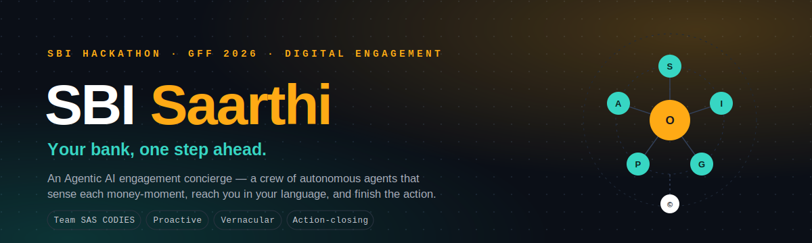

<br/>


**[▶&nbsp; Live demo](https://saudsatopay.github.io/sbi-saarthi/)** &nbsp;·&nbsp; **[📑&nbsp; Proposal (PDF)](SBI-Saarthi-Proposal.pdf)** &nbsp;·&nbsp; **[📊&nbsp; Idea deck (PPTX)](SBI-Saarthi-Idea-Deck.pptx)**

</div>

---

> **SBI Saarthi turns digital engagement from _broadcast_ into a _crew of autonomous AI agents_** that sense each customer's money-moment, reach them in their own language, and **complete the action for them** — every step consent-gated, guardrail-checked and audit-logged. It is engagement for all **50 crore** SBI customers, not just the 1% who get a relationship manager.

<div align="center">

| | |
|---:|:---|
| **What** | An Agentic AI engagement concierge over YONO & omnichannel |
| **For** | SBI Hackathon @ Global Fintech Fest 2026 — _Digital Engagement_ |
| **By** | Team **SAS CODIES** — Saud Satopay · Aryan Walunj · Sahil Addagatla |
| **Stack** | LangGraph · Claude + SLMs · Bhashini/Sarvam · React + Vite |
| **Status** | Live interactive demo + 11-page proposal + 16-slide deck |

</div>

## Contents

[The problem](#-the-problem) · [The idea in one loop](#-the-idea--one-loop) · [How this aligns with SBI](#-how-this-aligns-with-sbi) · [What Saarthi does](#-what-saarthi-does) · [System architecture](#-system-architecture) · [How one agent-turn runs](#-how-one-agent-turn-runs) · [Hero scenarios](#-hero-scenarios) · [Bharat-first](#-built-for-bharat) · [Data, models & decisioning](#-data-models--decisioning) · [Why agentic](#-why-agentic-not-a-chatbot) · [Impact & business model](#-impact--business-model) · [Roadmap](#-roadmap) · [Tech stack](#-tech-stack) · [Trust & security](#-trust-security--compliance) · [Run it](#-run-it-locally) · [Team](#-team)

---

## 🩹 The problem

Digital engagement today is **reactive** (it waits for you to open the app), **generic** (one offer blasted to millions) and **unactionable** (it tells you something, then makes _you_ do the work). At SBI's scale, that is hundreds of crores of relationships reduced to a notification nobody opens.

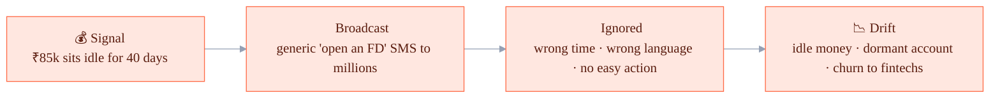

<div align="center">

**~1%** of customers get a human relationship manager &nbsp;•&nbsp; the other **49.5 crore** get the same broadcast SMS.
Engagement isn't a data problem — it's an **attention-and-action** problem.

</div>

## 🔁 The idea — one loop

A closed loop that reaches the right customer at the right moment and **finishes the job**. This is only possible with genuine agentic AI — autonomy, planning, tool-use and guardrails — not a chatbot.

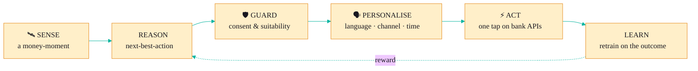

## 🎯 How this aligns with SBI

Saarthi is built around **what SBI is already solving for** under Digital Engagement — engagement depth, financial inclusion, deposit & cross-sell growth, dormant revival, and doing it safely at scale.

| What SBI is solving for | How Saarthi delivers it | Where you see it |
|---|---|---|
| **Make YONO a daily habit** (engagement depth) | Proactive money-moment nudges instead of waiting for the customer to log in | Live console + the "sense → act" loop |
| **Reach beyond metros** (financial inclusion) | 22-language, **voice-first** engagement built for tier-2/3 & rural Bharat | Dormant-revival **Tamil voice** scenario |
| **Deposit & cross-sell growth** | Next-best-action that **completes** the FD / SIP / insurance in one tap | Idle-money → Sweep-FD scenario |
| **Revive dormant & single-product accounts** | Detects dormancy, re-engages in-language with a relevant micro-goal | Dormant-revival scenario |
| **Defend against fintech churn** | Becomes the customer's financial _companion_, not a notification | "Action, not advice" — the whole loop |
| **Do it safely** (RBI · SEBI · DPDP · consent) | Guardrail agent: consent (Account Aggregator), suitability, audit, human-in-loop | Decision-governance chain on the product page |
| **At SBI scale, affordably** | Cost-tiered inference — small models for ~90% routine, Claude for the hard 10% | Architecture & tech sections |

## ✨ What Saarthi does

Six abilities, one crew:

| | Ability | What it means |
|---|---|---|
| 🛰️ | **Sense** | Detects money-moments in real-time event streams — idle balance, EMI at risk, dormancy, tax window, scam pattern |
| 🧠 | **Reason** | Runs propensity & next-best-action models per customer |
| 🗣️ | **Personalise** | Picks the language, channel and the _right moment_ |
| ⚡ | **Act** | One tap executes the outcome on banking APIs — end-to-end |
| 🛡️ | **Guard** | Consent, suitability, anti-spam & scam checks before anything ships |
| 🌱 | **Learn** | Every outcome retrains timing, channel and offers |

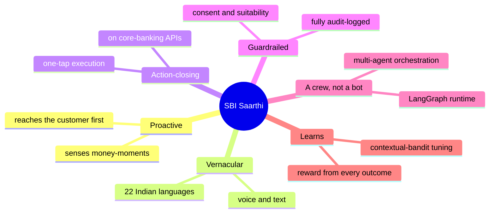

## 🏗️ System architecture

Event-driven, API-first and cloud-native. Signals flow into a **LangGraph** runtime where a crew of specialised agents reason, clear guardrails, personalise and act — then every outcome feeds a learning loop. Consent, audit and human-in-the-loop wrap the whole thing.

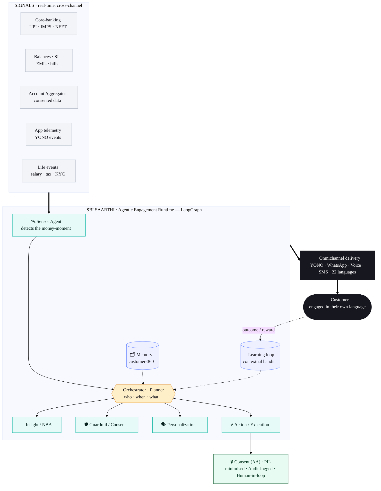

## ⚙️ How one agent-turn runs

What actually happens between a raw event and a finished, audited action:

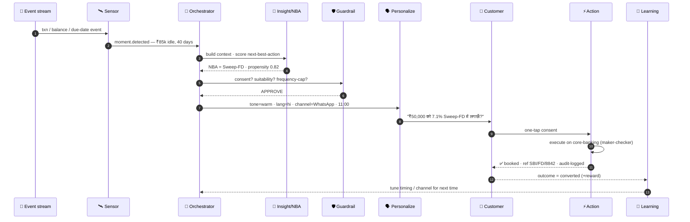

And the same turn as a **state machine** — note the guardrail and consent exits, so the bank never spams or acts silently:

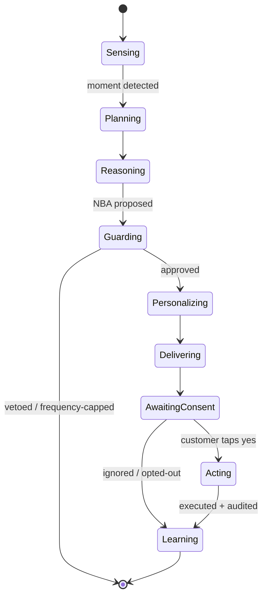

## 🎬 Hero scenarios

Five money-moments the live demo runs end-to-end, in **English / हिंदी / தமிழ்**:

| Scenario | The moment | Saarthi's action | Outcome |
|---|---|---|---|
| 💤 **Idle money** | ₹85,000 idle for 40 days | Move ₹50,000 to a 7.1% Sweep-FD | Idle funds mobilised |
| 🛡️ **EMI shield** | EMI due, salary not yet credited | Shift the due-date once, no penalty | Bounce prevented · CIBIL safe |
| 📞 **Dormant revival** | Account silent for 9 months | Vernacular **voice** call + a ₹500 micro-RD | Account reactivated |
| 🧾 **Tax saver** | FY-end, 80C still empty | Start a ₹12,500/mo ELSS SIP | ~₹46,800 tax saved |
| ⚠️ **Scam shield** | Risky transfer matches a known scam | Pause + warn + cancel & report | ₹40,000 saved |

## 🇮🇳 Built for Bharat

400M+ Indians will never use an English app. Saarthi is **voice-first and vernacular by default** — powered by AI4Bharat / Bhashini & Sarvam across 22 languages.

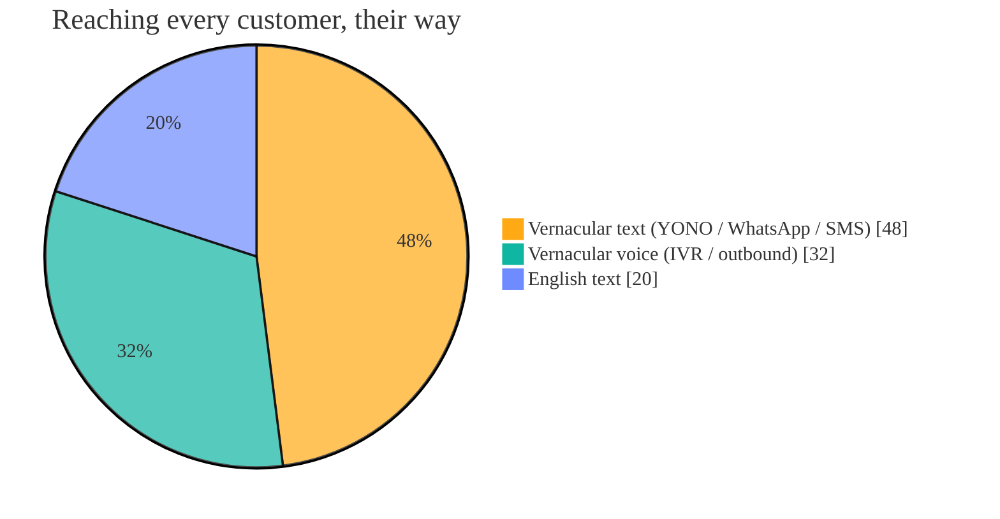

## 🧮 Data, models & decisioning

A funnel from raw events to a single, finished action — every stage observable and replayable.

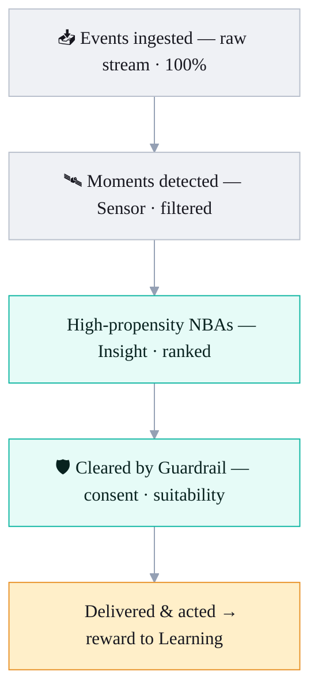

**Model mix — the right model for each job, cost-tiered for scale:**

| Job | Model |
|---|---|
| Plan · reason · tool-use · guardrails | **Claude** |
| High-volume routine next-best-action | **Fine-tuned SLMs** (≈ 90% of traffic) |
| Propensity scoring | XGBoost / LightGBM |
| Timing & channel choice | Contextual bandit |
| Product / policy retrieval | Embeddings + RAG (pgvector) |
| 22-language ASR · TTS · MT | AI4Bharat / Bhashini · Sarvam |

> _Synthetic data only in the prototype — **no real customer data**. Every feature traces to a consented, auditable source._

## 🤖 Why agentic, not a chatbot

Only one approach is proactive, vernacular, action-closing **and** guardrailed at once — because it's a crew of autonomous agents, not a single model.

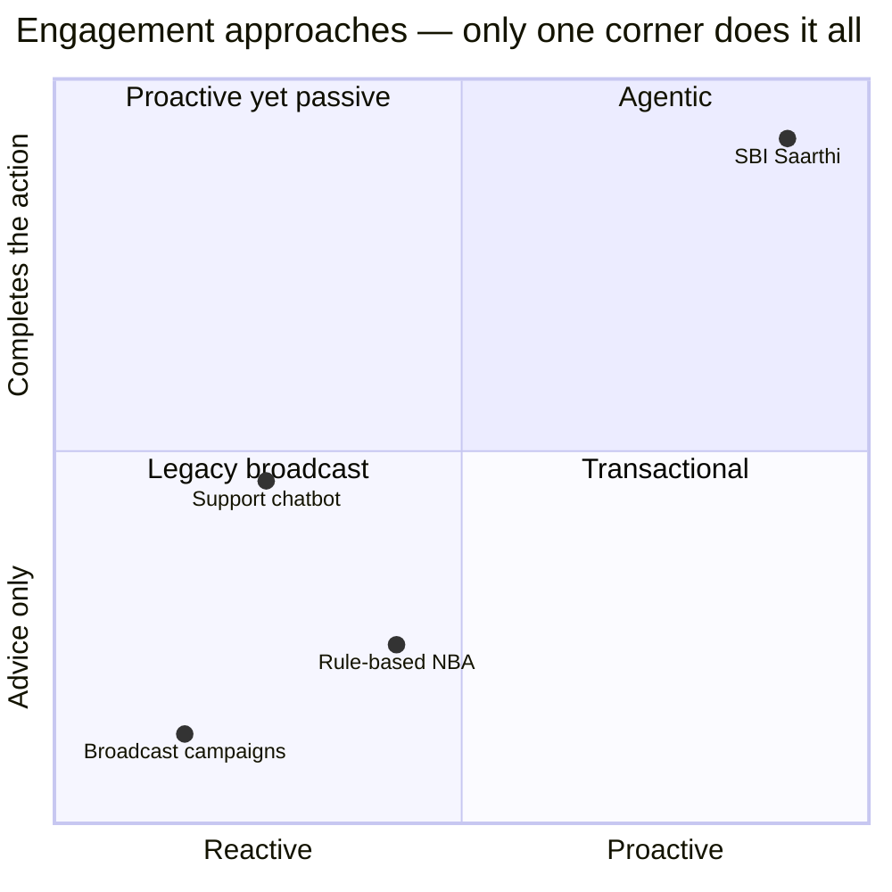

| | Proactive | Personalised | Vernacular + voice | Completes action | Multi-agent + guardrails | Learns |
|---|:---:|:---:|:---:|:---:|:---:|:---:|
| Broadcast campaigns | ❌ | ❌ | 🟡 | ❌ | ❌ | ❌ |
| Rule-based NBA | 🟡 | 🟡 | ❌ | ❌ | ❌ | 🟡 |
| Support chatbot | ❌ | 🟡 | 🟡 | 🟡 | ❌ | ❌ |
| **SBI Saarthi** | ✅ | ✅ | ✅ | ✅ | ✅ | ✅ |

## 📈 Impact & business model

<div align="center">

| +34% | ₹1,240 cr | 2.1M | +18% |
|:---:|:---:|:---:|:---:|
| monthly active engagement | idle funds mobilised | dormant accounts revived | cross-sell conversion |

<sub>Illustrative projections for the hackathon. At SBI scale, even a 1–2% lift across these levers is thousands of crores.</sub>

</div>

**Four value levers:** incremental product revenue · idle-fund mobilisation · dormant revival & retention · lower cost-to-serve.

**Commercial path:** runs internally as SBI's engagement layer, and productises as a licensable **Agentic Engagement Platform** for SBI subsidiaries, RRBs & co-operative banks — per-active-customer or outcome-based pricing.

## 🗺️ Roadmap

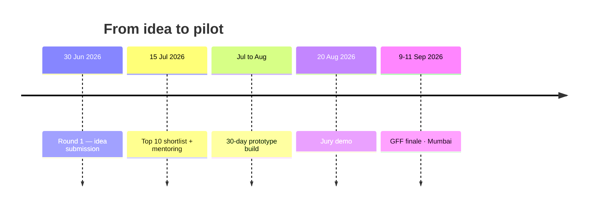

The 30-day prototype build, gated weekly:

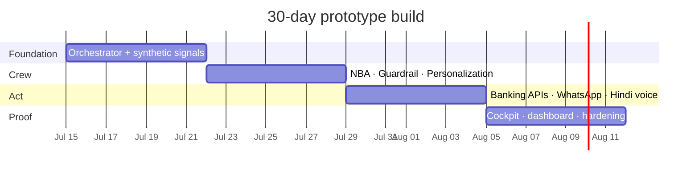

## 🧰 Tech stack

| Layer | Tools |
|---|---|
| **Agents** | LangGraph · CrewAI · Claude · fine-tuned SLMs |
| **Language & voice** | AI4Bharat / Bhashini · Sarvam ASR–TTS · 22 languages |
| **Decisioning** | XGBoost / LightGBM · contextual bandits · Feast feature store |
| **Data & realtime** | Apache Kafka · Postgres + pgvector · Redis |
| **Channels** | YONO in-app · WhatsApp Business · vernacular voice · SMS |
| **Trust & consent** | Account Aggregator (Sahamati) · OPA policy engine · audit trail |
| **This demo** | React 18 · TypeScript · Vite · Tailwind · Framer Motion |

## 🔒 Trust, security & compliance

Bank-grade by design — because a bank can't act on a black box.

| | |
|---|---|
| **Consent** | Account Aggregator (Sahamati) — tokenised, purpose-limited, revocable |
| **Privacy** | DPDP Act 2023 — PII redaction & tokenisation, data minimisation, India residency |
| **Regulatory** | RBI digital-lending & outsourcing norms; SEBI suitability for MF advice |
| **AI guardrails** | OPA policy engine + LLM-as-judge; suitability, frequency caps, allow/deny |
| **Security** | Encryption in transit & at rest, Vault/HSM secrets, RBAC, prompt-injection defence |
| **Auditability** | Immutable audit trail, full agent trace, explainable decisions, human override |

## 💻 Run it locally

```bash
npm install
npm run dev        # http://localhost:5173
npm run build      # outputs to /docs for GitHub Pages
```

## 🗂️ Repository

```text
sbi-saarthi/
├── src/                          # React + TS interactive demo
│   ├── components/               # Hero · DemoStage · Phone · AgentConsole · Architecture …
│   ├── data/                     # scenarios.ts (trilingual) · content.ts
│   └── lib/                      # useScenarioRunner.ts (the engagement engine)
├── proposal/
│   └── SBI_Saarthi_Proposal.html # print-grade 11-page proposal (HTML source)
├── assets/                       # README banner + diagrams
├── docs/                         # built site served by GitHub Pages
├── SBI-Saarthi-Proposal.pdf      # 11-page proposal (Bold color-block design)
└── SBI-Saarthi-Idea-Deck.pptx    # 16-slide pitch deck
```

## 👥 Team

**SAS CODIES**

| Member | Focus |
|---|---|
| **Saud Satopay** | Agents & backend — LangGraph orchestrator, agents, banking APIs |
| **Aryan Walunj** | ML & decisioning — NBA models, bandits, data & RAG |
| **Sahil Addagatla** | Frontend & vernacular — YONO/WhatsApp UX, voice, i18n |

---

<div align="center">

**Make every SBI customer feel _personally banked_ — proactively, in their own language, with the action already done.**

<sub>SBI Hackathon @ Global Fintech Fest 2026 · Theme: Agentic AI & Emerging Tech · Problem statement: Digital Engagement<br/>Concept prototype by Team SAS CODIES. Figures are illustrative. Not affiliated with State Bank of India.</sub>

</div>
